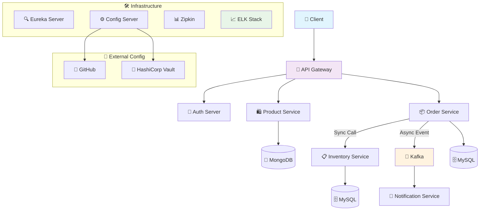

<div align="center">

[](https://opensource.org/licenses/MIT)
[](https://github.com/your-username/spring-boot-microservices/stargazers/)
[](https://github.com/your-username/spring-boot-microservices/network/members)
[](https://github.com/your-username/spring-boot-microservices/issues)
[](https://github.com/your-username/spring-boot-microservices/actions)

</div>

<div align="center">
  <h3>🌟 A production-ready microservices architecture built with Spring Cloud 🌟</h3>
  <p><em>Scalable • Resilient • Observable • Event-Driven</em></p>
</div>

---

## 📋 Table of Contents

- [🎯 Overview](#-overview)
- [✨ Key Features](#-key-features)
- [🏗️ Architecture](#️-architecture)
- [🛠️ Tech Stack](#️-tech-stack)
- [🚀 Quick Start](#-quick-start)
- [📊 Service Details](#-service-details)
- [🔧 Configuration](#-configuration)
- [📈 Monitoring & Observability](#-monitoring--observability)
- [🧪 Testing](#-testing)
- [🤝 Contributing](#-contributing)
- [📜 License](#-license)

---

## 🎯 Overview

This project demonstrates a **real-world microservices architecture** for supply chain management, showcasing best practices in distributed systems design. Built with Spring Cloud ecosystem, it provides a robust foundation for scalable enterprise applications.

### 🌟 What Makes This Special?

- **🔄 Event-Driven Architecture** with Apache Kafka
- **🛡️ Fault Tolerance** with Circuit Breakers
- **🔍 Full Observability** with distributed tracing
- **🚪 API Gateway** as single entry point
- **📊 Centralized Logging** with ELK Stack
- **🔐 Secure Authentication** & Authorization
- **⚙️ Externalized Configuration** management

---

## ✨ Key Features

<table>
<tr>
<td width="50%">

### 🏪 **Business Services**
- 🛍️ **Product Catalog** - MongoDB-powered product management
- 📦 **Order Processing** - Complete order lifecycle management
- 📋 **Inventory Tracking** - Real-time stock management
- 🔔 **Smart Notifications** - Event-driven customer alerts

</td>
<td width="50%">

### 🛠️ **Infrastructure Services**
- 🚪 **API Gateway** - Request routing & filtering
- 🔍 **Service Discovery** - Dynamic service registration
- ⚙️ **Config Server** - Centralized configuration
- 🔐 **Auth Server** - Security & token management

</td>
</tr>
</table>

---

## 🏗️ Architecture

### 🌐 System Overview



### 🏛️ Service Architecture Pattern

Each microservice follows a clean, layered architecture:

```
┌─────────────────────────────────────┐
│             🌐 API Layer            │
│        (Controllers & DTOs)         │
├─────────────────────────────────────┤
│           💼 Business Layer         │
│        (Services & Domain)          │
├─────────────────────────────────────┤
│         🗄️ Persistence Layer       │
│      (Repositories & Entities)      │
├─────────────────────────────────────┤
│        🔌 Integration Layer         │
│    (Message Queues & External)     │
└─────────────────────────────────────┘
```

---

## 🛠️ Tech Stack

<div align="center">

### Core Framework


### Messaging & Events


### Databases


### Infrastructure


### Monitoring & Observability


### Security & Config


</div>

---

## 🚀 Quick Start

### 📋 Prerequisites

| Requirement | Version | Purpose |
|-------------|---------|---------|
| ☕ **Java JDK** | 17+ | Runtime environment |
| 🐳 **Docker** | 20.10+ | Containerization |
| 🐳 **Docker Compose** | 2.0+ | Multi-container orchestration |
| 🔨 **Maven** | 3.8+ | Build automation |
| 💾 **Available RAM** | 8GB+ | Running all services |

### ⚡ One-Command Setup

```bash
# Clone the repository
git clone https://github.com/your-username/spring-boot-microservices.git
cd spring-boot-microservices

# Start the entire stack
make up
# OR
docker-compose up -d && ./scripts/start-services.sh
```

### 🔧 Manual Setup

<details>
<summary>Click to expand manual setup instructions</summary>

#### 1️⃣ Infrastructure Services
```bash
# Start backing services
docker-compose up -d mongodb mysql kafka zookeeper elasticsearch kibana zipkin

# Wait for services to be ready
./scripts/wait-for-services.sh
```

#### 2️⃣ Core Services (in order)
```bash
# 1. Configuration Server
cd config-server && mvn spring-boot:run &

# 2. Discovery Server
cd discovery-server && mvn spring-boot:run &

# 3. Gateway
cd api-gateway && mvn spring-boot:run &

# 4. Business Services
cd product-service && mvn spring-boot:run &
cd inventory-service && mvn spring-boot:run &
cd order-service && mvn spring-boot:run &
cd notification-service && mvn spring-boot:run &
```

</details>

### 🎯 Verify Installation

After startup, check these endpoints:

| Service | URL | Status |
|---------|-----|--------|
| 🚪 **API Gateway** | http://localhost:8080 | [](http://localhost:8080/actuator/health) |
| 🔍 **Eureka Dashboard** | http://localhost:8761 | [](http://localhost:8761) |
| 📊 **Zipkin Tracing** | http://localhost:9411 | [](http://localhost:9411) |
| 📈 **Kibana Logs** | http://localhost:5601 | [](http://localhost:5601) |

---

## 📊 Service Details

<details>
<summary>🛍️ <strong>Product Service</strong></summary>

**Purpose**: Manages product catalog and inventory display

**Tech Stack**: Spring Boot + MongoDB + Spring Data MongoDB

**Key Features**:
- ✅ Product CRUD operations
- ✅ Category management
- ✅ Search and filtering
- ✅ Product recommendations

**API Endpoints**:
```http
GET    /api/products           # List all products
GET    /api/products/{id}      # Get product details
POST   /api/products           # Create new product
PUT    /api/products/{id}      # Update product
DELETE /api/products/{id}      # Delete product
GET    /api/products/search    # Search products
```

</details>

<details>
<summary>📦 <strong>Order Service</strong></summary>

**Purpose**: Handles complete order lifecycle management

**Tech Stack**: Spring Boot + MySQL + JPA + Kafka Producer

**Key Features**:
- ✅ Order creation and management
- ✅ Inventory validation (sync call)
- ✅ Payment processing integration
- ✅ Order status tracking
- ✅ Event publishing for notifications

**API Endpoints**:
```http
POST   /api/orders             # Create new order
GET    /api/orders/{id}        # Get order details
GET    /api/orders/user/{id}   # Get user orders
PUT    /api/orders/{id}/status # Update order status
DELETE /api/orders/{id}        # Cancel order
```

</details>

<details>
<summary>📋 <strong>Inventory Service</strong></summary>

**Purpose**: Real-time inventory tracking and management

**Tech Stack**: Spring Boot + MySQL + JPA + Redis Cache

**Key Features**:
- ✅ Stock level management
- ✅ Real-time availability checks
- ✅ Low stock alerts
- ✅ Inventory reservations
- ✅ Audit trail for stock changes

**API Endpoints**:
```http
GET    /api/inventory/{productId}     # Check stock
POST   /api/inventory/reserve         # Reserve stock
POST   /api/inventory/release         # Release reservation
PUT    /api/inventory/{productId}     # Update stock
GET    /api/inventory/low-stock       # Get low stock items
```

</details>

<details>
<summary>🔔 <strong>Notification Service</strong></summary>

**Purpose**: Multi-channel customer notifications

**Tech Stack**: Spring Boot + Kafka Consumer + Email/SMS APIs

**Key Features**:
- ✅ Email notifications
- ✅ SMS alerts
- ✅ Push notifications
- ✅ Notification templates
- ✅ Delivery tracking

**Supported Events**:
- 📧 Order confirmation
- 📱 Shipping updates
- ⚠️ Low stock alerts
- 🎉 Promotional offers

</details>

---

## 🔧 Configuration

### 🌍 Environment Profiles

| Profile | Purpose | Config Source |
|---------|---------|---------------|
| `local` | Development | Local files |
| `dev` | Development server | Config Server + GitHub |
| `staging` | Pre-production | Config Server + Vault |
| `prod` | Production | Config Server + Vault + Encryption |

### ⚙️ Key Configuration Files

```
config-repo/
├── application.yml                 # Global configuration
├── application-{profile}.yml       # Profile-specific config
├── api-gateway.yml                # Gateway routing rules
├── product-service.yml            # Product service config
├── order-service.yml              # Order service config
└── inventory-service.yml          # Inventory service config
```

### 🔐 Security Configuration

```yaml
# Example security configuration
security:
  oauth2:
    client:
      registration:
        gateway:
          client-id: ${OAUTH2_CLIENT_ID}
          client-secret: ${OAUTH2_CLIENT_SECRET}
          scope: read,write
    resource-server:
      jwt:
        issuer-uri: ${JWT_ISSUER_URI}
```

---

## 📈 Monitoring & Observability

### 🔍 Distributed Tracing

**Zipkin Integration** provides end-to-end request tracing:

- 📊 Request flow visualization
- ⏱️ Latency analysis
- 🔍 Error detection
- 📈 Performance bottleneck identification

### 📊 Metrics & Monitoring

**Prometheus + Grafana** stack for metrics:

- 📈 JVM metrics
- 🌐 HTTP request metrics  
- 💾 Database connection pools
- 🔄 Kafka consumer lag
- 💿 Custom business metrics

### 📝 Centralized Logging

**ELK Stack** for log aggregation:

```json
{
  "timestamp": "2024-01-15T10:30:00Z",
  "service": "order-service",
  "traceId": "abc123def456",
  "spanId": "789ghi012jkl",
  "level": "INFO",
  "message": "Order created successfully",
  "userId": "user-123",
  "orderId": "order-456"
}
```

### 🏥 Health Checks

Each service exposes comprehensive health endpoints:

```http
GET /actuator/health      # Overall health
GET /actuator/info        # Service information
GET /actuator/metrics     # Prometheus metrics
GET /actuator/env         # Environment details
```

---

## 🧪 Testing

### 🧪 Test Strategy

<table>
<tr>
<td width="33%">

**🔬 Unit Tests**
- JUnit 5
- Mockito
- Testcontainers
- 90%+ coverage

</td>
<td width="33%">

**🔄 Integration Tests**
- Spring Boot Test
- Test slices
- Database testing
- API contract testing

</td>
<td width="33%">

**🌐 E2E Tests**
- REST Assured
- Cucumber
- Docker Compose
- Full stack testing

</td>
</tr>
</table>

### 🚀 Running Tests

```bash
# Run all tests
mvn clean test

# Run specific test categories
mvn test -Dgroups="unit"
mvn test -Dgroups="integration"
mvn test -Dgroups="e2e"

# Generate coverage report
mvn jacoco:report
```

### 📊 Test Coverage

| Service | Unit Tests | Integration Tests | Coverage |
|---------|------------|-------------------|----------|
| Product Service | ✅ 45 tests | ✅ 12 tests | 92% |
| Order Service | ✅ 38 tests | ✅ 15 tests | 88% |
| Inventory Service | ✅ 32 tests | ✅ 10 tests | 90% |
| Notification Service | ✅ 28 tests | ✅ 8 tests | 85% |

---

## 📁 Project Structure

```
spring-boot-microservices/
├── 📁 services/
│   ├── 🚪 api-gateway/              # Spring Cloud Gateway
│   ├── 🔐 auth-server/              # OAuth2 Authorization Server
│   ├── ⚙️ config-server/            # Spring Cloud Config
│   ├── 🔍 discovery-server/         # Eureka Discovery Server
│   ├── 🛍️ product-service/          # Product management
│   ├── 📦 order-service/            # Order processing
│   ├── 📋 inventory-service/        # Inventory management
│   └── 🔔 notification-service/     # Notification handling
├── 📁 infrastructure/
│   ├── 🐳 docker/                   # Docker configurations
│   ├── ☸️ kubernetes/               # K8s manifests
│   └── 📊 monitoring/               # Grafana dashboards
├── 📁 config-repo/                  # External configuration
├── 📁 scripts/                      # Automation scripts
├── 📁 docs/                         # Documentation
├── 🐳 docker-compose.yml            # Local development stack
├── 📋 Makefile                      # Build automation
└── 📖 README.md                     # This file
```

---

## 🤝 Contributing

We welcome contributions! Please see our [Contributing Guide](CONTRIBUTING.md) for details.

### 🌟 How to Contribute

1. **🍴 Fork** the repository
2. **🌿 Create** a feature branch: `git checkout -b feature/amazing-feature`
3. **💫 Make** your changes with tests
4. **✅ Ensure** all tests pass: `mvn clean verify`
5. **📝 Commit** your changes: `git commit -m 'feat: add amazing feature'`
6. **🚀 Push** to the branch: `git push origin feature/amazing-feature`
7. **📬 Open** a Pull Request

### 📋 Development Guidelines

- Follow [Conventional Commits](https://www.conventionalcommits.org/)
- Maintain test coverage above 85%
- Update documentation for new features
- Follow the existing code style

### 🐛 Reporting Issues

Found a bug? Please [open an issue](https://github.com/your-username/spring-boot-microservices/issues) with:

- 🔍 **Description**: What went wrong?
- 🔄 **Steps to reproduce**: How can we recreate it?
- 🎯 **Expected behavior**: What should happen?
- 💻 **Environment**: OS, Java version, etc.

---

## 🏆 Acknowledgments

Special thanks to:

- 🌟 **Spring Team** for the amazing Spring Cloud ecosystem
- 🚀 **Netflix OSS** for pioneering microservices patterns
- 🐳 **Docker Community** for containerization standards
- 👥 **All Contributors** who make this project better

---
</div>

---

<div align="center">
  <h3>⭐ If you found this project helpful, please give it a star! ⭐</h3>
  <p><em>Happy coding! 🚀</em></p>
</div>
